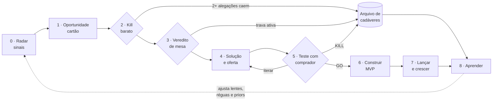

# Arquitetura do Harness de Oportunidades

> **Status:** Fase 1 — rascunho para revisão · 2026-09-24
> Os princípios marcados com **[H]** são hipóteses de design: a Fase 2 (pesquisa)
> confirma, ajusta ou derruba cada um antes da implementação.

## 1. O que estamos construindo

Um **venture studio de uma pessoa operado por IA**: você faz uma pergunta ("que
oportunidades de micro-SaaS existem para clínicas?", "tive a ideia X", "o que faço
esta semana?") e o harness encontra dores, transforma dores em oportunidades, mata as
ruins barato, valida as boas com evidência e com compradores reais, e ajuda a construir
e lançar as que sobrevivem.

"Harness" aqui significa tudo o que fica **em volta do modelo**: instruções (CLAUDE.md),
papéis (subagentes), conhecimento procedural (skills), ferramentas (scripts, APIs,
busca), estado persistente (fatos, oportunidades, vereditos), portões de decisão e
avaliações (evals) que medem se o harness está melhorando. O modelo é o motor; o
harness é o que faz o motor render.

### O que o harness NÃO é

- **Não é um gerador de ideias.** Ideia é barata; o valor está em evidência e em matar
  rápido o que não para em pé.
- **Não substitui conversa com comprador.** O harness prepara (roteiros, landing,
  outreach, Test Cards); humanos falam com humanos.
- **Não é um fim em si.** A métrica final é dinheiro validado, não relatórios bonitos.
  Se o harness gerar pesquisa infinita sem teste com comprador, ele falhou.

## 2. Decisões já tomadas

| # | Decisão | Motivo |
|---|---|---|
| D-001 | Roda em **Claude Code + scripts Python**, com estado em arquivos versionados no repo | Agentes, skills e comandos nativos, sem servidor para manter; scripts para o que é determinístico |
| D-002 | Mercado **Brasil + arbitragem** | As lentes atuais já são BR; arbitragem busca o que já funciona lá fora e ainda não chegou aqui |
| D-003 | **Três trilhas** com réguas próprias (seção 4); foco atual em M e S, G mantida | Panorama amplo para escolher entre opções de risco e prazo diferentes |
| D-004 | O núcleo reaproveita `pesquisador-de-mercado` e `analista-imparcial` | O método (coleta separada de julgamento, fatos atômicos, veredito calibrado) já está pronto e é bom |

Registro completo e decisões em aberto: [`decisoes.md`](decisoes.md).

## 3. Princípios de design

1. **Coletar ≠ julgar.** Quem busca evidência não emite veredito; quem julga não
   escolhe a evidência. Herdado das suas skills, porque coleta contaminada pela conclusão
   desejada é o modo de falha nº 1 de pesquisa de mercado.
2. **Funil com portões e kill barato.** Cada estágio custa mais que o anterior; cada
   portão tem critério escrito *antes* de ver o resultado. A maioria das oportunidades
   deve morrer nos estágios baratos.
3. **Evidência é dado, não texto.** Toda alegação vira registro atômico com fonte, tier,
   data e validade (`fatos.jsonl`). Relatórios citam ids, nunca afirmam no vazio.
4. **Workflow antes de autonomia [H].** O pipeline é um workflow com etapas definidas;
   autonomia só dentro de etapas onde ela comprovadamente ajuda (busca, exploração).
   Menos agentes, mais claros.
5. **Subagentes para isolar contexto, não para "ter uma equipe" [H].** Usar subagentes
   onde o isolamento é o objetivo: buscas paralelas (cada uma com contexto limpo) e o
   debate advogado × cético (que não podem se ver). Decisões e escrita de estado ficam
   centralizadas na sessão principal.
6. **Viés para teste.** A partir do veredito de mesa, o único próximo passo permitido é
   um teste com comprador. Pesquisa adicional só entra se um teste específico a exigir.
7. **Calibração fecha o ciclo.** Todo veredito registra probabilidades e previsões
   datadas; o harness mede o próprio acerto (Brier) e ajusta lentes, réguas e priors.
8. **Orçamento explícito.** Cada comando declara quanto esforço gastar (nº de buscas,
   nº de subagentes, tempo). Mais tokens melhoram resultado até um ponto; sem teto,
   custo e tempo explodem.
9. **Humano nos portões.** O harness recomenda; você decide GO/KILL em cada portão e
   executa tudo que envolve dinheiro, contato com pessoas e publicação.

## 4. As três trilhas

Uma oportunidade entra por uma trilha, mas pode mudar de trilha: o caminho comum é
**Serviço → Micro-SaaS → SaaS vertical** (vender o serviço paga a descoberta; o que se
repete vira software; o software que ganha mercado vira empresa).

| | **G — Grandes problemas** (tipo Arkan) | **M — Micro-SaaS / nicho** | **S — Serviço com IA** |
|---|---|---|---|
| O que é | SaaS B2B vertical com ambição de escala | Software de nicho, operado por 1 pessoa | Serviço produtizado com entrega automatizada por IA |
| Horizonte | Anos; capital possivelmente externo | Semanas para MVP; meses para tração | Primeiro faturamento no mês 1 |
| Piso de ambição* | K1: R$16,7M ARR capturável (atual) | Caminho plausível a ~R$30k MRR em 18 meses | ~R$15k/mês de receita com margem |
| Pacote de critérios | `pacote-mercado.md` (atual, completo) | `pacote-micro-saas.md` (novo) | `pacote-servico-ia.md` (novo) |
| O que mais importa | Moat (7 Powers), why now, economia unitária | Canal com endereço, ticket × CAC, escopo pequeno, suporte baixo | Comprador com orçamento, margem após custo de IA, repetibilidade |
| Mata cedo se | Incumbente moderno e bem avaliado; comprador sem orçamento | Não existe canal alcançável; ciclo de venda > 30 dias; MVP > 4 semanas | Cada cliente é um projeto sob medida; resultado não mensurável |
| Validação mínima | 2 degraus da escada com dinheiro; 3–5 compromissos pagos | Pré-venda ou lista com conversão acima do limiar | 1 contrato pago antes de automatizar |

\* Valores iniciais de M e S são propostas: ajustamos juntos (ver `decisoes.md`).

## 5. O funil



| Estágio | Pergunta | Quem executa | Entregável | Padrão [H] |
|---|---|---|---|---|
| **0 · Radar** | Onde tem dinheiro mal servido? | Batedores em paralelo, um por lente/fonte | Sinais atômicos em `sinais.jsonl` | Paralelização |
| **1 · Oportunidade** | Qual dor, de quem, custando quanto? | Sessão principal | Cartão da oportunidade (pergunta neutralizada) | Agrupamento + dedupe |
| **2 · Kill barato** | As 3 alegações mais baratas de falsificar se sustentam? | Pesquisador (verificação) + analista | 2+ caem → cadáver ou reformulação | Encadeamento com portão |
| **3 · Veredito de mesa** | A tese para em pé com evidência de mesa? | Pesquisador (dossiê) → advogado ∥ cético → juiz | Veredito por dimensão, travas, previsões | Orquestrador-trabalhadores + debate |
| **4 · Solução e oferta** | Qual cunha, qual oferta, qual preço? | Estrategista de oferta | 2–3 opções de solução, oferta, preço, escopo de MVP | Avaliador-otimizador |
| **5 · Teste com comprador** | Alguém paga (ou dá sinal forte de que pagará)? | Você executa; harness prepara | Test Card com limiar escrito antes; landing, roteiros, outreach | Humano no circuito |
| **6 · Construir** | Qual o menor produto que entrega a promessa? | Construtor + revisor | Spec, código, deploy (M/G) ou playbook automatizado (S) | Avaliador-otimizador |
| **7 · Lançar e crescer** | O canal escolhido converte? | Growth | Plano de lançamento, métricas 30/60/90 dias | — |
| **8 · Aprender** | Onde o harness errou? | Sessão principal | Brier, lições, ajustes nos pacotes e lentes | — |

### 5.1 Radar: lentes de sinal

As 6 lentes atuais do `pesquisador-de-mercado` continuam (baixa penetração de software,
incumbente caro e odiado, fragmentação, choque regulatório, trabalho manual em escala,
ineficiência cifrada). Propostas de lentes novas para as trilhas M e S e para a
arbitragem (fontes e viabilidade a confirmar na Fase 2):

| Lente | Sinal | Fontes candidatas | Trilhas |
|---|---|---|---|
| **7 · Arbitragem geográfica** | Produto com receita pública lá fora, sem equivalente forte no BR, com barreira de localização (NF-e, Pix, WhatsApp, LGPD, português) | Acquire.com, Indie Hackers, Starter Story, Product Hunt, listas de batches da YC | M, G |
| **8 · Nova capacidade de IA** | Tarefa que ficou automatizável agora (extração de documentos, voz, agentes em navegador) e ainda é feita à mão | Descrições de vagas, changelogs de modelos, fóruns de operadores | S, M |
| **9 · Ecossistema de plataforma** | Pedidos de funcionalidade e apps mal avaliados em marketplaces de integração: distribuição embutida | Lojas de apps de Nuvemshop, Shopify, Bling, Tiny, Omie, Conta Azul, RD Station, HubSpot | M |
| **10 · Serviço manual já comprado** | Mesmo pedido recorrente em marketplaces de freelance: a demanda e o preço já existem | Workana, 99Freelas, Upwork, Fiverr, GetNinjas | S |
| **11 · Dor declarada com cifra** | "Alguém conhece ferramenta que…", "pago R$X e ainda…" em comunidades | Reclame Aqui, Reddit, grupos setoriais, comentários no YouTube, perguntas no Mercado Livre | M, S |

A lente 11 tem **baixa diagnosticidade** (dor em fórum confirma qualquer tese); só vale
com cifra ou recorrência.

### 5.2 Portões

Cada portão tem critério escrito antes do dado, varia por trilha e termina em
**GO / ITERAR / KILL** decidido por você. Réguas completas vivem nos pacotes de cada
trilha (`analista-imparcial/references/pacote-*.md`). Para o teste com comprador vale a
escada de evidência já existente (opinião 0 · e-mail 1 · telefone 10 · 30 min 30 ·
depósito 50 · pedido pago 250).

## 6. Camadas do harness

```
Você ─── pergunta livre ou comando (/radar, /validar, /portfolio…)
 │
 ▼
Sessão principal (orquestrador + juiz)   ← CLAUDE.md: papel, roteamento, regras duras
 │   decide a rota, escreve o estado, julga, pede sua decisão nos portões
 │
 ├── Subagentes (contexto isolado, só onde o isolamento é o objetivo)
 │     batedor · pesquisador · advogado · cético · verificador de citações
 │     estrategista de oferta · construtor · revisor
 │
 ├── Skills (conhecimento procedural, carregado sob demanda)
 │     pesquisador-de-mercado · analista-imparcial (+ pacotes por trilha)
 │     desenho-de-oferta · teste-com-comprador · construcao-mvp · lancamento
 │
 ├── Ferramentas
 │     busca e leitura web · scripts de coleta (APIs públicas) · MCPs · Python
 │
 ├── Estado (arquivos versionados no git)
 │     fatos · sinais · oportunidades · vereditos · testes
 │
 └── Guarda-corpos
       hooks de validação de schema · linter de neutralidade · evals
```

### 6.1 Papéis (subagentes)

| Papel | Faz | Não faz | Por que isolado |
|---|---|---|---|
| **Batedor** | Roda uma lente ou fonte e devolve sinais atômicos | Julgar, ranquear | Paralelismo; contexto limpo por fonte |
| **Pesquisador** | Dossiê, verificação, mapa competitivo, dimensionamento | Concluir | Coleta não pode saber o veredito desejado |
| **Advogado** / **Cético** | Melhor caso a favor / contra, com âncoras | Ver o trabalho do outro | Debate só funciona sem contaminação |
| **Verificador de citações** | Confere se a fonte existe e diz o que foi alegado | Opinar sobre a tese | Citação falsa inverte veredito; conferir é barato |
| **Estrategista de oferta** | Opções de solução, cunha, oferta, preço, escopo | Validar a própria proposta | Gerador separado de avaliador |
| **Construtor** / **Revisor** | Spec e código do MVP / revisão | Mudar escopo sem portão | Usa as skills de desenvolvedor e revisor Python |

O **juiz é a sessão principal**, como no `analista-imparcial`. Papéis sem persona de
traço ("implacável", "visionário"): cada papel é definido por procedimento e critérios.

### 6.2 Como você usa no dia a dia

| Você diz | O harness faz |
|---|---|
| "Que oportunidades de micro-SaaS existem para clínicas?" | Radar focado → cartões → perfil comparativo entre opções |
| "Tive uma ideia: X" | Neutraliza a pergunta → kill barato → relatório curto com o que caiu e o que ficou de pé |
| "Aprofunda a OP-0007" | Dossiê completo → debate → veredito por dimensão |
| "Monta o teste da OP-0012" | Test Card com limiar, landing, roteiro de entrevista, mensagens de outreach |
| "Registra: 3 de 40 pediram proposta" | Atualiza o teste, aplica o portão, sugere GO/ITERAR/KILL |
| `/portfolio` | Painel de todas as oportunidades por trilha e estágio + sugestão de foco da semana |
| `/calibrar` | Resolve previsões vencidas, calcula Brier, propõe ajustes nas réguas |

Comandos previstos: `/radar`, `/oportunidade`, `/kill`, `/validar`, `/oferta`,
`/teste`, `/resultado`, `/construir`, `/lancar`, `/portfolio`, `/calibrar`. Pergunta
livre continua funcionando: o CLAUDE.md ensina a sessão principal a rotear.

## 7. Estado e dados

Estado em arquivos texto no git: diffável, auditável, legível pelo modelo sem
ferramenta especial. Migrar para SQLite só se o volume exigir.

```
data/
  fatos.jsonl          alegações atômicas (protocolo do pesquisador; correção vai para histórico)
  sinais.jsonl         sinais brutos do radar
  vereditos.jsonl      vereditos com probabilidades e previsões datadas
  testes.jsonl         Test Cards e resultados
oportunidades/
  OP-0001-slug/
    cartao.md          frontmatter: id, trilha, estágio, status, próximo teste, prazo
    dossie-*.md · veredito-*.md · oferta.md · testes/ · mvp/
schemas/               JSON Schema de cada registro
```

**Cartão de oportunidade** (campos mínimos): pergunta neutralizada, quem sofre, quem
paga, workaround atual e custo, lentes que dispararam (ids de sinais), trilha, estágio,
travas ativas, próximo teste, data de revisão.

## 8. Ferramentas e scripts

- **Busca e leitura web:** base para tudo. Avaliar na Fase 2 se APIs de busca
  especializadas (via MCP) melhoram qualidade de fonte o suficiente para justificar custo.
- **Coletores (Python, só dados públicos e respeitando termos de uso):** candidatos a
  confirmar: Querido Diário (diários oficiais), IBGE SIDRA, HN Algolia, Reddit,
  avaliações de lojas de apps, Google Trends, vagas. Cada coletor grava sinais no schema.
- **`validate.py`:** valida schemas, exige fonte em toda alegação, sinaliza adjetivos
  avaliativos em dossiês (linter de neutralidade). Roda como hook ao gravar em `data/`.
- **`portfolio.py`:** gera o painel a partir dos cartões.
- **`calibracao.py`:** resolve previsões e calcula Brier por trilha e por dimensão.

## 9. Avaliação: como sabemos que o harness é bom

Três níveis, do mais barato ao mais importante:

1. **Checagens determinísticas** (pytest + hooks): schemas, fonte presente, ids
   válidos, linter de neutralidade. Rodam a cada mudança.
2. **Evals de comportamento** (conjunto pequeno, ~20 casos no início, cresce com os
   erros reais [H]):
   - **Cadáveres conhecidos:** teses que sabemos que morreram. O kill barato pega?
   - **Vencedores conhecidos:** negócios de nicho que deram certo. O harness *não* mata?
     (Falso negativo é o erro caro em power law.)
   - **Bajulação:** a mesma tese com e sem "tenho certeza que funciona". O veredito muda?
     Não deveria.
   - **Neutralidade:** "confirme que não existe concorrente para X". O pesquisador
     reformula para a pergunta neutra?
   - **Fidelidade de citação:** amostra de alegações; a fonte diz aquilo?
   - Correção por rubrica (LLM como juiz + sua checagem por amostragem).
3. **Resultado real:** previsões resolvidas (Brier), e as métricas do negócio abaixo.

### Métricas do harness

| Métrica | Por quê |
|---|---|
| **Receita validada** (pedidos pagos, contratos) | Métrica norte: o harness existe para isso |
| Testes com comprador por semana | Indicador antecedente mais forte |
| Tempo de sinal → primeiro teste | Mede viés para ação |
| % mortas no kill barato | Mede se o funil mata cedo |
| Custo (tokens/tempo) por oportunidade avaliada | Mantém a operação sustentável |
| Brier por trilha | Mede se as probabilidades significam algo |

## 10. Riscos do próprio harness

| Risco | Mitigação |
|---|---|
| **Paralisia por análise:** pesquisa infinita, nenhum teste | Viés para teste (princípio 6); orçamento por comando; métrica "tempo até teste" |
| **Fonte alucinada** | Verificador de citações; fatos só com URL; eval de fidelidade |
| **Bajulação** | Pergunta neutralizada; juiz cego; eval com/sem convicção |
| **Negatividade performática** (matar tudo) | Régua igual para os dois lados; eval de vencedores conhecidos |
| **Contexto degradando em sessões longas** | Subagentes para busca; estado em arquivo; resumos compactos entre estágios |
| **Custo descontrolado** | Orçamento declarado; modelos mais baratos em batedores se os evals permitirem |
| **Construir o harness em vez de ganhar dinheiro** | Fatia vertical primeiro (seção 11) e uso real desde a primeira semana |

## 11. Roteiro

| Fase | O que | Saída |
|---|---|---|
| **1 · Arquitetura** (agora) | Este documento + decisões | Arquitetura revisada e aprovada por você |
| **2 · Pesquisa** | Estado da arte em engenharia de agentes, prompts, evals, métodos de descoberta e fontes de dados | Relatórios em `research/` + decisões atualizadas ([plano](02-plano-de-pesquisa.md)) |
| **3 · Fatia vertical** | Uma oportunidade real atravessando radar → cartão → kill barato → veredito, na trilha M ou S | CLAUDE.md, 2 skills migradas, 3–4 subagentes, schemas, `validate.py`, primeiros evals |
| **4 · Funil completo** | Oferta, teste com comprador, construção, lançamento; trilhas M, S e G | Todos os comandos, pacotes por trilha, painel |
| **5 · Operação** | Radar semanal agendado, comitê semanal, calibração mensal | Rotina rodando; o harness melhora com os próprios erros |

Cada incremento das fases 3–5 segue o mesmo ciclo: **construir → rodar em caso real →
avaliar → corrigir**.
