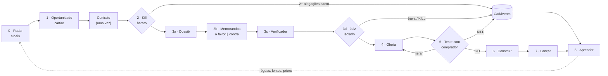

# Arquitetura do Harness de Oportunidades

> **Status:** v2 · 2026-09-24 · atualizada depois da Fase 2 (pesquisa).
> Mudanças em relação à v1 estão marcadas com **[v2]** e vêm dos relatórios em
> `research/`. Decisões que tomei sem você estão em [`revisao-pendente.md`](revisao-pendente.md).

## 1. O que estamos construindo

Um **venture studio de uma pessoa operado por IA**: você faz uma pergunta ("que
oportunidades de micro-SaaS existem para clínicas?", "tive a ideia X", "o que faço esta
semana?") e o harness encontra dores, transforma dores em oportunidades, mata as ruins
barato, valida as boas com evidência e com compradores reais, e ajuda a construir e
lançar as que sobrevivem.

"Harness" é tudo o que fica **em volta do modelo**: instruções (CLAUDE.md), papéis
(subagentes), conhecimento procedural (skills), ferramentas (CLI, scripts, busca), estado
persistente (fatos, sinais, vereditos, testes), portões de decisão, guarda-corpos (hooks)
e avaliações (evals).

### O que o harness não é

- **Não é um gerador de ideias.** Ideia é barata; o valor está em evidência e em matar
  rápido o que não para em pé.
- **Não substitui conversa com comprador.** O harness prepara (Test Card, roteiros,
  página, mensagens); você fala com as pessoas, publica e cobra.
- **Não é um fim em si.** A métrica final é dinheiro validado, não relatórios.

## 2. Decisões

Registro completo em [`decisoes.md`](decisoes.md). As centrais: roda em Claude Code +
Python (D-001); Brasil + arbitragem (D-002); três trilhas G, M, S (D-003) com pisos
próprios (D-007); núcleo nas suas skills de pesquisa e julgamento, trazidas para o repo
(D-004); estado em JSONL + Markdown (D-005); fatia vertical primeiro (D-006).

## 3. Princípios de design

1. **Coletar ≠ julgar.** Quem busca evidência não emite veredito; quem julga não escolhe
   a evidência.
2. **Funil com portões e kill barato.** Cada estágio custa mais que o anterior; cada
   portão tem critério escrito antes do dado. **[v2]** O critério fica num
   `contrato.json` gravado uma vez, antes da coleta.
3. **Evidência é dado.** Toda alegação vira fato atômico com fonte, tier, **[v2]** trecho
   literal e tipo de leitura (integral, resumo de busca, memória), data e validade.
4. **Workflow antes de autonomia.** O funil é um workflow; autonomia só dentro da coleta.
   **[v2]** Tudo que é determinístico (validar, gerar ids, montar a entrada do juiz,
   conferir trechos, calcular regras de teste, encolher probabilidades) é código na CLI,
   não prosa.
5. **[v2] Isolar quem avalia, não quem executa.** Subagentes existem para isolar contexto:
   buscas paralelas (cada uma com contexto limpo) e avaliadores que não podem ver a
   convicção de ninguém (memorandos, juiz). Escrita de estado passa sempre pela CLI, que
   é o escritor único.
6. **Viés para teste.** Depois de um veredito GO, o próximo passo é teste com comprador.
7. **Calibração fecha o ciclo.** Vereditos registram probabilidades e previsões datadas.
   **[v2]** Brier acumulado com intervalo; réguas só mudam por calibração depois de ~100
   previsões resolvidas. Testes com comprador resolvem em dias e são a fonte mais rápida
   dessas previsões.
8. **Orçamento explícito.** Cada comando declara quanto gasta (buscas, subagentes).
   **[v2]** A busca nativa tem teto de 200 chamadas por sessão, compartilhado: um comando
   pesado por sessão.
9. **Humano nos portões.** GO / ITERAR / KILL, contato com pessoas, publicação e dinheiro
   são seus.
10. **[v2] Estrutura, não retórica.** Pedir virtude ao modelo ("seja imparcial", "use a
    taxa-base") tem efeito fraco ou nulo. Funciona tirar o gatilho (o juiz nunca vê a
    convicção) e acrescentar dado verificável (trecho literal, taxa-base como campo).

## 4. As três trilhas

Uma oportunidade entra por uma trilha e pode subir: **Serviço → Micro-SaaS → SaaS
vertical**. O serviço paga a descoberta e acumula o que protege um micro-SaaS na era da
IA (canal, conhecimento dos sistemas locais difíceis, dado sobre exceções), desde que cada
correção humana seja registrada.

| | **G · Grandes problemas** (tipo Arkan) | **M · Micro-SaaS / nicho** | **S · Serviço com IA** |
|---|---|---|---|
| O que é | SaaS B2B vertical com ambição de escala | Software de nicho, 1 pessoa, B2B por padrão | Serviço produtizado com entrega automatizada |
| Piso (critério de rejeição) | R$16,7M ARR capturável | Teto estacionário ≥ R$30k MRR em 18 meses com o canal declarado | R$15k/mês com margem ≥60% **depois das suas horas** |
| Pacote | `pacote-mercado` | `pacote-micro-saas` **[v2]** | `pacote-servico-ia` **[v2]** |
| Travas | Economia unitária; comprador e orçamento | Canal com endereço; ticket e retenção | Comprador com orçamento; margem após horas; repetibilidade |
| Mata cedo se | Incumbente moderno e bem avaliado; comprador sem orçamento | Sem canal alcançável; ciclo > 30 dias; ticket < R$150 sem custo de troca; IA nativa replica | Projeto sob medida; resultado não mensurável; IA nativa replica; fora dos termos da plataforma |
| Validação mínima | 2 degraus com dinheiro de decisores com orçamento | **[v2]** 1 degrau com dinheiro para construir o MVP; replicação antes de gastar com escala | **[v2]** 1 contrato pago para começar a entregar; 3 do mesmo ICP antes de automatizar |

**[v2] Taxas-base.** Dos produtos independentes que já faturam, ~15–25% chegam a ~R$30k
de MRR algum dia e provavelmente menos de 10% em 18 meses; a cauda brasileira é mais
fina. O piso de M mede o **teto** do mercado e do canal; a probabilidade de você chegar
lá é estimada à parte. Números vindos de resumos de busca: são ponto de partida, não
régua.

## 5. O funil



| Estágio | Comando | Quem executa | Entregável |
|---|---|---|---|
| 0 · Radar | `/radar` | até 4 `batedor` em paralelo | Sinais em `data/sinais.jsonl` |
| 1 · Oportunidade | `/oportunidade` | sessão principal | Cartão com pergunta neutralizada |
| 2 · Kill barato | `/kill` | sessão principal (contrato) + `pesquisador` (verificação) | 3 alegações: sustentada / caiu / não encontrada; regra "2+ caem" |
| 3 · Validação de mesa | `/validar` | `pesquisador` → `memorando` ×2 → `verificador` → `juiz` | Veredito por dimensão com p, travas e previsões |
| 4 · Oferta | Fase 4 | skill na sessão principal + revisor isolado **[v2]** | Opções de solução, cunha, preço |
| 5 · Teste com comprador | `/teste`, `/resultado` | você executa; o harness prepara | Test Card com regra calculada antes; material |
| 6 · Construir | Fase 4 | sessão dedicada + revisor isolado **[v2]** | MVP (M/G) ou playbook automatizado (S) |
| 7 · Lançar | Fase 4 | — | Plano e métricas 30/60/90 |
| 8 · Aprender | `/calibrar` | sessão principal | Brier, lições, análise de erros |

### 5.1 Lentes de sinal

Onze lentes, com fontes, queries e o que evitar em
`.claude/skills/metodo-pesquisa/references/lentes.md`. **[v2]** Achado central da pesquisa
de fontes: o Estado brasileiro abre quase tudo por API gratuita (PNCP, CNPJ, CAGED,
diários oficiais), enquanto as plataformas privadas onde a dor aparece se fecharam
(Reclame Aqui, Mercado Livre, LinkedIn, Reddit). As lentes "de governo" viram as fontes
de sinal mais fortes; fórum vira gerador de hipótese. Na arbitragem (lente 7), "aceita
Pix" deixou de ser barreira: sobram nota fiscal (NFS-e, IBS/CBS), fluxos de WhatsApp,
ecossistemas de contador e ERP, e português.

### 5.2 Portões e testes

Cada portão termina em GO / ITERAR / KILL decidido por você. **[v2]** Regras de teste em
`references/teste-com-comprador.md`:
- escada ordinal com degrau de reputação;
- deflator só para preço declarado;
- intenção de compra nunca abre GO;
- teste sequencial (SPRT) com tráfego web;
- regra Beta-Binomial para poucas contas B2B.

Tudo é calculado antes do teste por `python3 -m harness regra-teste`.

## 6. Camadas

```
Você ─── pergunta livre ou comando (/radar, /kill, /validar, /teste, /portfolio…)
 │
 ▼
Sessão principal: orquestra e apresenta, não julga        ← CLAUDE.md (mapa, 73 linhas)
 │
 ├── Subagentes (.claude/agents/)
 │     batedor · pesquisador · verificador          coleta e conferência (Sonnet)
 │     memorando ×2 · juiz                           avaliadores isolados (Opus fixado,
 │                                                   sem CLAUDE.md, só leitura)
 ├── Skills (.claude/skills/)
 │     metodo-pesquisa (+ 11 lentes) · metodo-julgamento (+ pacotes G/M/S, formato,
 │     teste com comprador) · 8 comandos
 ├── CLI python3 -m harness                         escritor único do estado
 │     validar · adicionar · atualizar · novo-cartao · contrato · pacote-juiz ·
 │     registrar-veredito · conferir-trecho · regra-teste · portfolio · calibracao
 ├── Estado (git)  data/*.jsonl · oportunidades/OP-NNNN-slug/
 └── Guarda-corpos .claude/settings.json
       PreToolUse bloqueia edição direta do estado · PostToolUse e Stop validam ·
       SessionStart instala dependências na nuvem
```

### 6.1 Por que o juiz é assim [v2]

O isolamento padrão de um subagente vaza por quatro caminhos: ele carrega o CLAUDE.md, vê
o git status, pode ser um fork com toda a conversa, e recebe a tarefa escrita pelo
orquestrador. Por isso:

- `omitClaudeMd: true`, ferramentas só de leitura, sem criar agentes, modelo fixado;
- a entrada é um arquivo gerado por `pacote-juiz`: tese como proposta de terceiro,
  memorandos renomeados A/B em ordem sorteada com o mesmo teto de tamanho, lista fechada
  de arquivos;
- o orquestrador passa só a mensagem impressa pelo comando;
- nos evals, o juiz roda via `claude -p` num diretório neutro, sem CLAUDE.md nem git.

O juiz verifica cada ponto dos memorandos contra o dossiê, avalia dimensão por dimensão
em nota absoluta, parte da taxa-base com ajustes nomeados em log-odds, e a CLI encolhe a
probabilidade final em direção à taxa-base (modelos atuais são superconfiantes).

**Ressalva registrada:** o ganho de debate na literatura foi medido com juízes que não
viam a fonte; o nosso vê. O primeiro eval de capacidade compara "juiz só com o dossiê"
contra "juiz com memorandos". Se os memorandos não ajudarem, saem e o custo cai.

## 7. Estado

```
data/
  fatos.jsonl        alegações atômicas (trecho literal, leitura, verificação, histórico)
  sinais.jsonl       sinais do radar
  vereditos.jsonl    vereditos com p bruta e encolhida, ajustes, previsões datadas
  testes.jsonl       Test Cards e resultados
oportunidades/OP-NNNN-slug/
  cartao.md          frontmatter validado + narrativa e histórico
  contrato.json      régua gravada antes da coleta (não muda)
  dossie-*.md        evidência (linter de linguagem avaliativa)
  memorandos/        a-favor.md, contra.md
  juiz/<data>-<n>/   entrada cega, memorandos A/B, resposta
  testes/<id>/       material do teste com comprador
schemas/             JSON Schema de cada registro
```

Escritas passam pela CLI, com trava de arquivo (subagentes em paralelo não geram ids
repetidos). Correção de fato nunca sobrescreve: vai para `historico`. Mudança de cartão
é anotada no histórico do próprio cartão.

## 8. Ferramentas e coletores

- **Busca nativa** para descobrir; **`curl` / `r.jina.ai`** para ler o texto literal (a
  leitura nativa devolve um resumo de outro modelo, que não serve como trecho).
- **`conferir-trecho`**: baixa a página e confere o trecho literal de cada fato.
- **Coletores** (Fase 3/4, dependem da rede, R-02), na ordem:
  1. base comum;
  2. yc-oss (o único que responde desta nuvem hoje);
  3. PNCP;
  4. 99Freelas;
  5. consumidor.gov.br;
  6. contagens de CNPJ;
  7. Hacker News;
  8. TrustMRR;
  9. Google Play pt-BR;
  10. YouTube.

  Cada fonte passa antes por robots.txt e termos de uso.
- **MCPs** (desligados até você decidir, R-14): `mcp-brasil` para dados do governo; Exa ou
  Parallel para busca de empresas e volume.

## 9. Avaliação

Detalhe em [`evals/README.md`](../evals/README.md).

- **Nível 1, grátis a cada mudança:** pytest com schemas, referências, faixas, linter e
  invariantes dos agentes, mais os hooks.
- **Nível 2, pago quando o comportamento pode mudar:** bajulação em três braços
  (implementado), roteamento, consistência sem gabarito, juiz de citação e backtest com
  dossiê congelado.
- **Nível 3, resultado real:** previsões resolvidas (Brier acumulado com intervalo) e as
  métricas abaixo.

| Métrica | Por quê |
|---|---|
| Receita validada (pedidos pagos, contratos) | Métrica norte |
| Testes com comprador por semana | Melhor indicador antecedente |
| Tempo de sinal → primeiro teste | Viés para ação |
| % mortas no kill barato e tempo até o kill | Matar cedo é sucesso, não fracasso |
| Custo por oportunidade avaliada | Operação sustentável (juiz ≈ US$0,70 por execução) |
| Brier acumulado por trilha, com intervalo | Probabilidades que significam algo |

## 10. Riscos do próprio harness

| Risco | Mitigação |
|---|---|
| Paralisia por análise | Viés para teste; orçamento por comando; métrica de tempo até teste |
| Fonte alucinada ou mal lida | Trecho literal + `conferir-trecho` + verificador que lê a página |
| Bajulação | Juiz isolado; entrada gerada por código; eval de três braços |
| Negatividade performática | Memorando pode dizer "nada material"; juiz verifica cada objeção; eval com casos vencedores (E7) |
| Teto de busca esgotado em silêncio | Falha de busca é lacuna, nunca "ausência"; um comando pesado por sessão |
| Texto da web com instruções | Tratado como dado; validador marca trechos com cara de comando |
| Construir o harness em vez de ganhar dinheiro | Fatia vertical usável agora; próximas fases guiadas por uso real |

## 11. Roteiro

| Fase | Estado | O que |
|---|---|---|
| 1 · Arquitetura | ✅ | Este documento |
| 2 · Pesquisa | ✅ | 5 relatórios em `research/`, com adotar / descartar / testar |
| 3 · Fatia vertical | 🔶 em andamento | Pronto: CLI, schemas, hooks, agentes, skills, comandos até `/teste`, evals E0/E1/E4. Falta: rodar uma oportunidade real de ponta a ponta com rede, coletor yc-oss, evals E3/E5 |
| 4 · Funil completo | ⏳ | Oferta, construção, lançamento; coletores PNCP, 99Freelas, consumidor.gov.br; E6/E7 |
| 5 · Operação | ⏳ | Radar semanal como rotina agendada, comitê semanal, calibração mensal |
